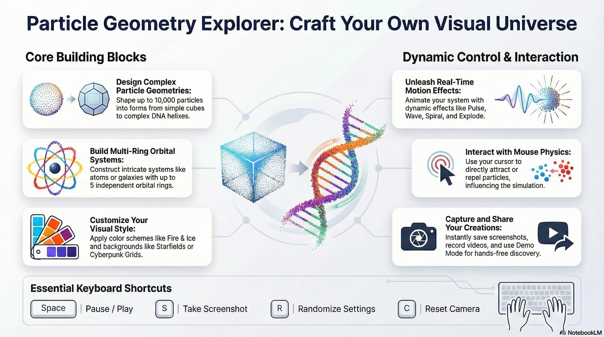

# ✨ Particle Geometry Explorer

**A stunning, interactive 3D particle simulation engine built with Three.js**

*Create mesmerizing particle systems • Design complex orbital structures • Capture beautiful visualizations*

---

## 📖 About

Particle Geometry Explorer is a sophisticated web-based tool that lets you create, customize, and interact with stunning 3D particle simulations. Whether you're visualizing atomic structures, crafting abstract art, or simply exploring the beauty of geometry, this application provides an intuitive interface with powerful capabilities.

## 🌟 Features

<table>
<tr>
<td width="50%">

### ⬡ Particle System
- **Diverse Shapes** — Sphere, Cube, Tetrahedron, Torus, DNA Helix, custom text, and more
- **Custom Sprites** — Circles, Stars, Hearts, Happy Faces, and additional styles
- **Scalability** — Render up to 10,000 particles with adjustable density

</td>
<td width="50%">

### ✨ Motion & Effects
- **Dynamic Effects** — Pulse, Wave, Spiral, Breathe, and Explode animations
- **Time Control** — Adjust speed, rotation, and animation delays
- **Interactive Physics** — Particles react to mouse (Attract/Repel modes)

</td>
</tr>
<tr>
<td width="50%">

### 🌀 Orbital Rings
- **Complex Systems** — Up to 5 independent orbital rings
- **Presets** — Atom, Solar System, Galaxy configurations
- **Customization** — Fine-tune size, speed, orientation, and tilt

</td>
<td width="50%">

### 🎨 Visual Customization
- **Color Palettes** — Fire, Ice, Forest, Neon, Cyberpunk themes
- **Backgrounds** — Solid, Starfield, Nebula, Cyberpunk Grid
- **Enhancements** — Particle Glow, Trails, Connection Lines

</td>
</tr>
</table>

### 🛠️ Tools & Utilities
| Feature | Description |
|---------|-------------|
| **Demo Mode** | Auto-randomize settings for hands-free exploration |
| **Recording** | Capture screenshots and record videos |
| **Save/Load** | Export and import configurations via JSON |
| **Diagnostics** | Monitor FPS and system performance stats |

---

## 🎮 Controls

### Mouse & Touch

| Input | Action |
|-------|--------|
| Left Click + Drag | Rotate camera |
| Right Click + Drag | Pan camera |
| Scroll Wheel | Zoom in/out |
| Touch (1 finger) | Rotate |
| Pinch (2 fingers) | Zoom |
| 3 Finger Drag | Pan |

### ⌨️ Keyboard Shortcuts

| Key | Action |
|-----|--------|
| `Space` | Pause/Play animation |
| `S` | Take screenshot |
| `R` | Randomize settings |
| `C` | Reset camera |
| `M` | Lock/Unlock camera |
| `D` | Toggle diagnostics |
| `F` | Toggle fullscreen |

---

## 🚀 Getting Started

### Quick Start
1. **[Launch the Live Demo](https://jbx99.github.io/Particle-Geometry-Explorer/particle-explorer.html)** — No installation required!

### Local Installation
1. Clone or download this repository
2. Open `particle-explorer.html` in any modern browser (Chrome, Firefox, Safari, Edge)
3. Start exploring!

> 💡 **Tip**: Click the `☰` button or use "Include UI in Video" toggle for clean visuals when recording.

---

## 💻 Technologies

| Technology | Purpose |
|------------|---------|
| **HTML5 & CSS3** | User interface and layout |
| **JavaScript (ES6+)** | Core application logic |
| **[Three.js](https://threejs.org/)** | WebGL 3D rendering engine |

---

## 📝 License

This project is open for personal and educational use.

---

**[🚀 Launch Demo](https://jbx99.github.io/Particle-Geometry-Explorer/particle-explorer.html)** • **[📖 User Guide](USER_GUIDE.md)**

