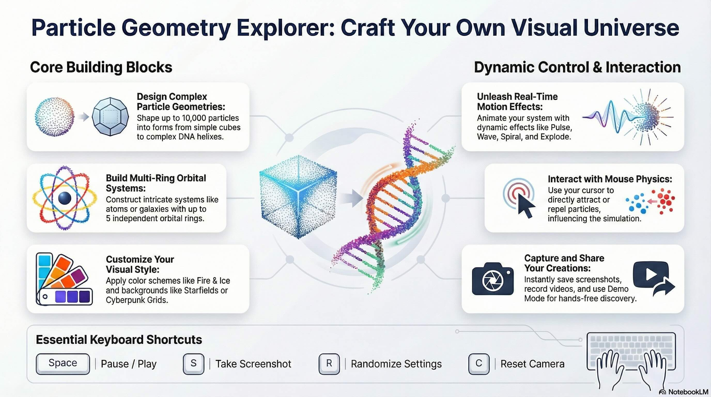

# Particle Geometry Explorer

**An interactive 3D particle simulation engine built with Three.js**

*Create particle systems · Design orbital structures · Capture visualizations*

---

## About

Particle Geometry Explorer is a web-based creative tool for building and interacting with 3D particle simulations. Visualize atomic structures, craft abstract art, or explore the geometry of sacred and platonic solids — all from a single HTML file with no build step required.

The control panel uses collapsible sections for a clean workspace. Expand only the sections you need, and collapse the rest.

## Features

<table>
<tr>
<td width="50%">

### Particle System
- **25+ Shapes** — Platonic solids, sacred geometry (Seed of Life, Merkaba, Metatron's Cube, Flower of Life), DNA Helix, custom text, and more
- **9 Sprite Types** — Circle, Star, Heart, Diamond, Triangle, and others
- **Scalability** — Render up to 10,000 particles with adjustable density

</td>
<td width="50%">

### Motion & Effects
- **Dynamic Effects** — Pulse, Wave, Spiral, Breathe, and Explode animations
- **Time Control** — Adjust speed, rotation, and animation delays
- **Interactive Physics** — Particles react to mouse with Attract/Repel modes
- **Gravity Wells** — Up to 3 configurable gravity wells that pull particles

</td>
</tr>
<tr>
<td width="50%">

### Orbital Rings
- **Complex Systems** — Up to 5 independent orbital rings
- **Presets** — Atom, Solar System, Galaxy configurations
- **Customization** — Size, speed, orientation, tilt, and independent ring speeds

</td>
<td width="50%">

### Visual Customization
- **8 Color Palettes** — Default, Fire, Ice, Forest, Sunset, Neon, Gold, Monochrome
- **4 Color Modes** — By Index, Distance, Height, or Velocity
- **7 Backgrounds** — Solid, Gradient, Starfield, Cyberpunk Grid, Nebula, Checkerboard, Chess Board
- **Enhancements** — Particle Glow, Trails, Connection Lines

</td>
</tr>
</table>

### Tools & Utilities
| Feature | Description |
|---------|-------------|
| **Demo Mode** | Auto-randomize settings on a timer for hands-free exploration |
| **Recording** | Capture screenshots and record videos (with optional UI visibility) |
| **Presets** | Save, load, export, and import configurations via Base64 codes |
| **Diagnostics** | Real-time FPS, frame time, particle count, camera state, and memory usage |
| **Shockwave** | Trigger an expanding force wave through the particle field |

---

## Controls

### Mouse & Touch

| Input | Action |
|-------|--------|
| Left Click + Drag | Rotate camera |
| Right Click + Drag | Pan camera |
| Scroll Wheel | Zoom in/out |
| Touch (1 finger) | Rotate |
| Pinch (2 fingers) | Zoom |
| 3 Finger Drag | Pan |

### Keyboard Shortcuts

| Key | Action |
|-----|--------|
| `Space` | Pause / Play animation |
| `S` | Take screenshot |
| `R` | Randomize settings |
| `C` | Reset camera |
| `M` | Lock / Unlock camera |
| `W` | Trigger shockwave |
| `D` | Toggle diagnostics |
| `F` | Toggle fullscreen |
| `V` | Start / Stop video recording |

---

## Getting Started

### Quick Start
1. **[Launch the Live Demo](https://jbx99.github.io/Particle-Geometry-Explorer/particle-explorer.html)** — No installation required.

### Local Installation
1. Clone or download this repository
2. Open `particle-explorer.html` in any modern browser (Chrome, Firefox, Safari, Edge)
3. An internet connection is needed on first load for the Three.js CDN

> **Tip**: Click the `☰` button to hide the control panel, or use the "Include UI in Video" toggle for clean recordings.

---

## Technologies

| Technology | Purpose |
|------------|---------|
| **HTML5 & CSS3** | UI layout, glassmorphic styling |
| **JavaScript (ES6+)** | All application logic (~3,000 lines) |
| **[Three.js r128](https://threejs.org/)** | WebGL 3D rendering engine (loaded from CDN) |

Single-file architecture — no build system, bundler, or package manager required.

---

## License

This project is open for personal and educational use.

---

**[Launch Demo](https://jbx99.github.io/Particle-Geometry-Explorer/particle-explorer.html)** · **[User Guide](USER_GUIDE.md)**

